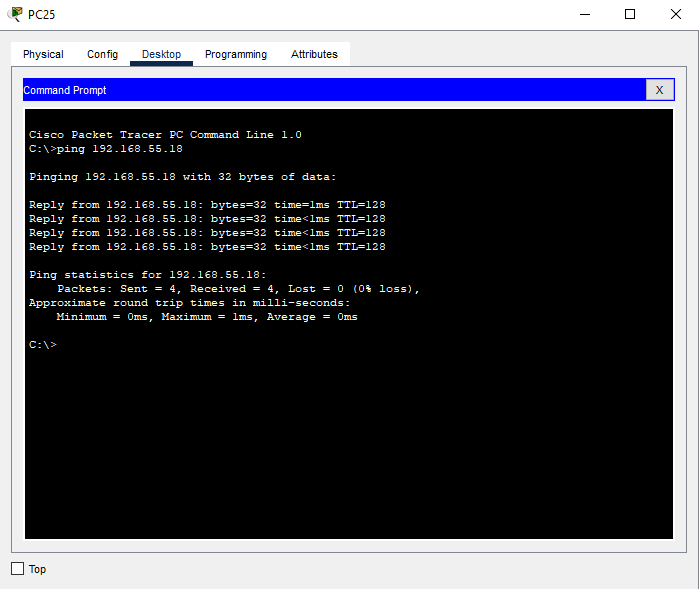
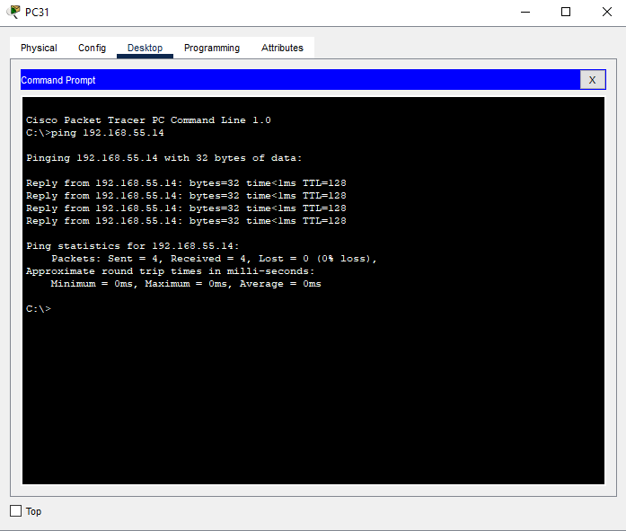
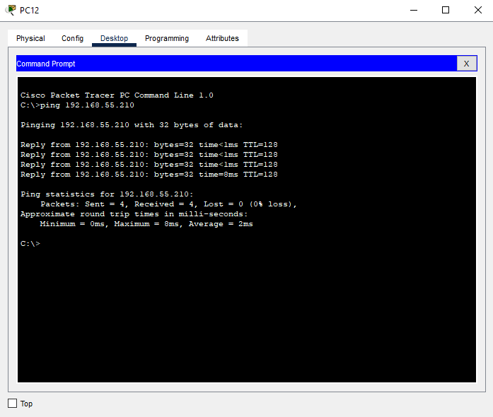
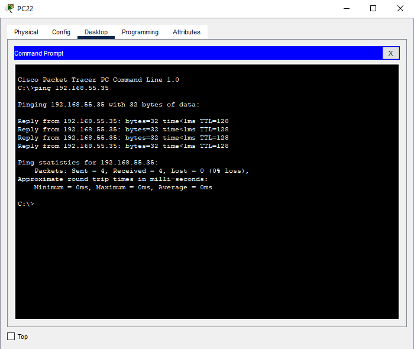
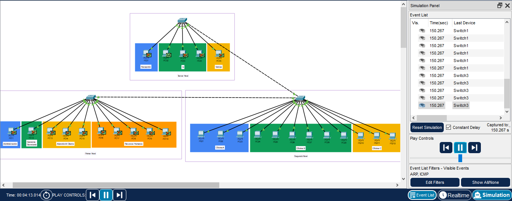

*Universidad de San Carlos de Guatemala*  
*Facultad de Ingenieria*  
*Escuela de Ciencias y Sistemas*  
*Redes De Computadoras 1*  
*Segundo Semestre 2024.*  

___
## **Practica 1**
___
**201908355 - Danny Hugo Bryan Tejaxún Pichiyá**

### Configuración De Las VPCs
#### 1. Nivel 1 PC11: Administración

#### 2. Nivel 1 PC12: Gerencia/Secretaría

#### 3. Nivel 1 PC13: Atención Al Cliente

#### 4. Nivel 1 PC16: Recursos Humanos

#### 5. Nivel 2 PC21: Oficina A

#### 6. Nivel 2 PC24: Oficina B

#### 7. Nivel 2 PC210: Oficina C

#### 8. Nivel 3 PC31: Recepción

#### 9. Nivel 3 PC32: TI

#### 10. Nivel 3 PC35: Ventas

### Pings Entre Los Hosts
#### 1. Ping PC11 Administración Nivel 1 A PC34 TI Nivel 3

#### 2. Ping PC25 Oficina B Nivel 2 A PC18 RRHH Nivel 1

#### 3. Ping PC31 Recepción Nivel 3 Con PC14 Atención Al Cliente Nivel 1

#### 4. Ping PC12 Secretaría/Gerencia Nivel 1 Con PC210 Oficina C Nivel 2

#### 5. Ping PC22 Oficina A Nivel 2 Con PC35 Ventas Nivel 3

### Demostración De La Captura De Un Paquete ARP/ICMP
