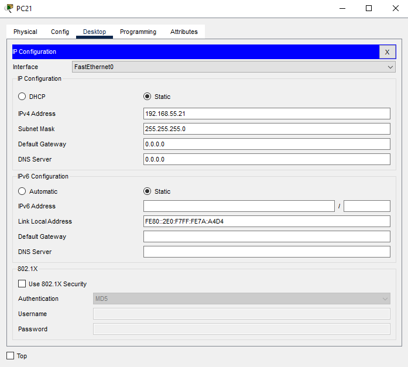
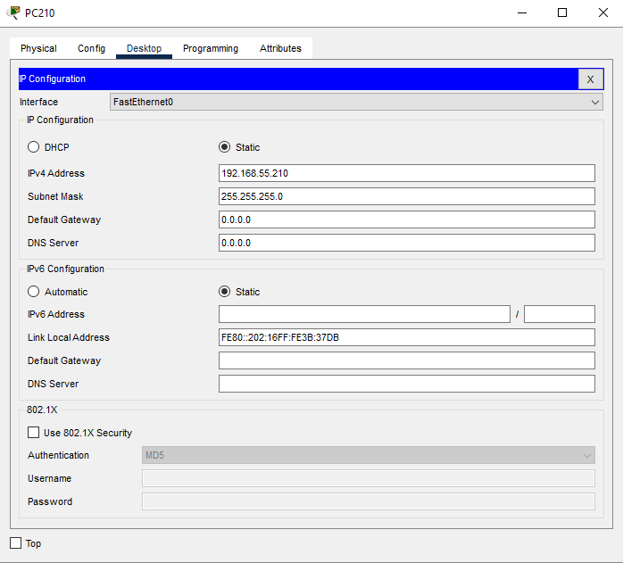
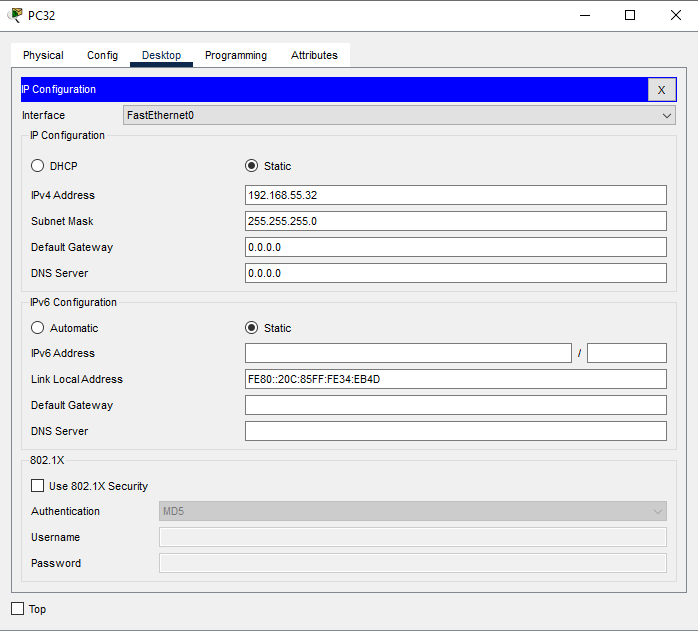

*Universidad de San Carlos de Guatemala*  
*Facultad de Ingenieria*  
*Escuela de Ciencias y Sistemas*  
*Redes De Computadoras 1*  
*Segundo Semestre 2024.*  

___
## **Practica 1**
___
**201908355 - Danny Hugo Bryan Tejaxún Pichiyá**

### Configuración de las VPCs
#### 1. Nivel 1 PC11: Administración

#### 2. Nivel 1 PC12: Gerencia/Secretaría

#### 3. Nivel 1 PC13: Atención Al Cliente

#### 4. Nivel 1 PC16: Recursos Humanos

#### 5. Nivel 2 PC21: Oficina A

#### 6. Nivel 2 PC24: Oficina B

#### 7. Nivel 2 PC210: Oficina C

#### 8. Nivel 3 PC31: Recepción

#### 9. Nivel 3 PC32: TI

#### 10. Nivel 3 PC35: Ventas

