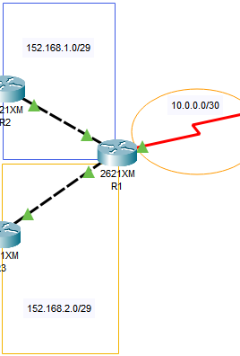
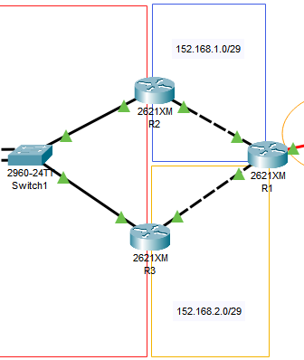
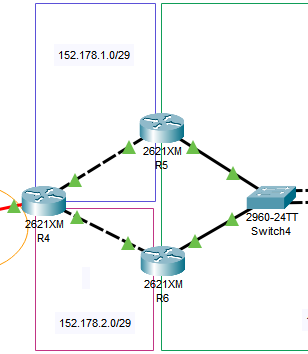
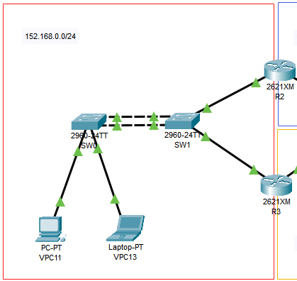
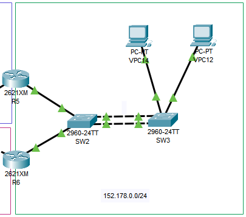
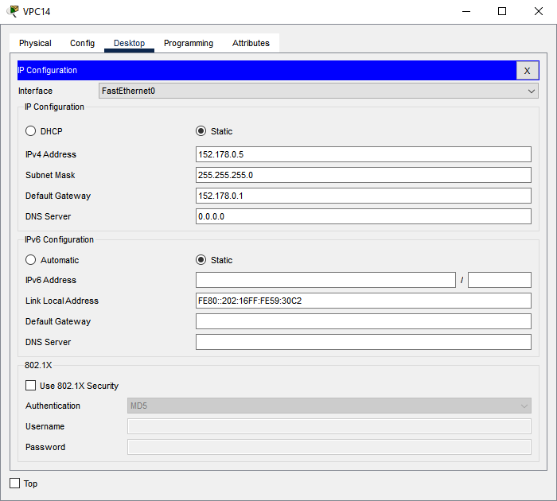

*Universidad de San Carlos de Guatemala*  
*Facultad de Ingenieria*  
*Escuela de Ciencias y Sistemas*  
*Redes De Computadoras 1*  
*Segundo Semestre 2024.*  

___
## **Practica 2**
___
**201908355 - Danny Hugo Bryan Tejaxún Pichiyá**

### Configuración De Los Routers R1, R2 y R6
#### 1. R1
Se configuró un enlace serial de este router con R4.  

```sh
enable
configure terminal
no ip domain-lookup
hostname R1
# Seria0/0
interface se0/0
ip add 10.0.0.1 255.255.255.252
no shutdown
# FastEthernet0/0
interface f0/0
ip add 152.168.1.2 255.255.255.248
no shutdown
# FastEthernet0/1
interface fa0/1
ip add 152.168.2.2 255.255.255.248
no shutdown
```

#### 2. R2
Se configuró HSRP en este router.  

```sh
enable
configure terminal
no ip domain-lookup
hostname R2
# FastEthernet0/1
interface fa0/1
ip add 152.168.0.2 255.255.255.0
standby 1 ip 152.168.0.1
standby 1 priority 150
standby 1 preempt
no shutdown
# FastEthernet0/0
interface f0/0
ip add 152.168.1.1 255.255.255.248
no shutdown
```

#### 3. R6
Se configuró HSRP en este router.  

```sh
enable
configure terminal
no ip domain-lookup
hostname R6
# FastEthernet0/1
interface fa0/1
ip add 152.178.0.3 255.255.255.0
standby 2 ip 152.178.0.1
no shutdown
# FastEthernet0/0
interface f0/0
ip add 152.178.2.2 255.255.255.248
no shutdown
```

### Configuración De Los Switches Sw1 y Sw3
#### 1. SW1
Se configuró el PortChannel con el protocolo PAGP.  

```sh
enable
configure terminal
interface range fa0/1-2
channel-group 1 mode desirable
exit
interface port-channel 1 
switchport mode trunk
end
wr
```

#### 2. SW3
Se configuró el PortChannel con el protocolo HSRP.  

```sh
enable
configure terminal
interface range fa0/1-2
channel-group 1 mode active
exit
interface port-channel 1
switchport mode trunk
end
wr
```

### Configuración De Las VPC VPC11 y VPC14
#### 1. VPC11
Se configuró con IP estática `152.168.0.4` con máscara de subred `/24` ó `255.255.255.0` y puerta de enlace `152.168.0.1`  


#### 2. VPC14
Se configuró con IP estática `152.178.0.5` con máscara de subred `/24` ó `255.255.255.0` y puerta de enlace `152.178.0.1`  


### Rutas Estáticas
Es importante tomar en cuenta todos los caminos posibles que pueda tomar enviar paquetes por cada una de las redes. Las rutas que se definen a continuación son para el router 1. Para los demás routers algunas rutas cambian o ya no se incluyen y se incluyen otras distintas.
```sh
enable
conf t
ip route 152.168.0.0 255.255.255.0 152.168.1.1
ip route 152.168.0.0 255.255.255.0 152.168.2.1
ip route 152.168.1.0 255.255.255.248 152.168.1.1
ip route 152.168.2.0 255.255.255.248 152.168.2.1
ip route 10.0.0.0 255.255.255.252 10.0.0.2
ip route 152.178.1.0 255.255.255.248 10.0.0.2
ip route 152.178.2.0 255.255.255.248 10.0.0.2
ip route 152.178.0.0 255.255.255.0 10.0.0.2
do w
```

### PAGP
```sh
enable
configure terminal
interface range fa0/1-2
channel-group 1 mode desirable
exit
interface port-channel 1 
switchport mode trunk
end
wr
```

### LACP
```sh
enable
configure terminal
interface range fa0/1-2
channel-group 1 mode active
exit
interface port-channel 1
switchport mode trunk
end
wr
```

### HSRP
```sh
enable
configure terminal
no ip domain-lookup
hostname R2
# FastEthernet0/1
interface fa0/1
# IP Virtual
ip add 152.168.0.2 255.255.255.0
standby 1 ip 152.168.0.1
standby 1 priority 150
standby 1 preempt
no shutdown
# FastEthernet0/0
interface f0/0
ip add 152.168.1.1 255.255.255.248
no shutdown
```

### Configuración De VPC
| VPC | IP | Máscara de Subred | Puerta de Enlace |
| - | - | - | - |
| VPC11 | `152.168.0.4` | `/24` | `152.168.0.1` |
| VPC12 | `152.178.0.4` | `/24` | `152.178.0.1` |
| VPC13 | `152.168.0.5` | `/24` | `152.168.0.1` |
| VPC14 | `152.178.0.5` | `/24` | `152.178.0.1` |

### Comandos De Verificación
* Para ver la configuración general de un dispositivo (router o switch)
```sh
enable
show running-config
```
* Para validar que HSRP está configurado correctamente en los routers
```sh
enable
show standby
```
* Para validar la configuración de PAGP y LACP en los switches
```sh
enable
show etherchannel
```