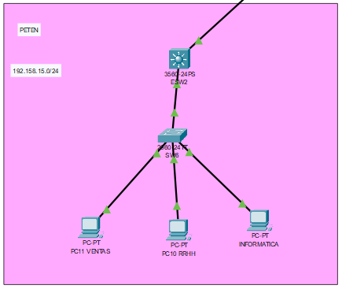

*Universidad de San Carlos de Guatemala*  
*Facultad de Ingenieria*  
*Escuela de Ciencias y Sistemas*  
*Redes De Computadoras 1*  
*Segundo Semestre 2024.*  

___
## **Proyecto 2**
**201900087 - José Manuel Lacán Chavajay**  
**201908355 - Danny Hugo Bryan Tejaxún Pichiyá** 

## 1. Resumen de Direcciones IP y VLAN

### Sede Jutiapa
| Dispositivo | Interfaz | | IP | Máscara de subred |
|:---:|:---:|:---:|:---:|:---:|
|  |  | RRHH (VLAN 17) |  |  |
| VPC - | fa0/ - |  | 192.168.15.2  | /28 |
| VPC - | fa0/ - |  | 192.168.15.3  | /28 |
| VPC 0 | fa0/11 |  | 192.168.15.4  | /28 |
| VPC 1 | fa0/12 |  | 192.168.15.5  | /28 |
| VPC - | fa0/ - |  | 192.168.15.6  | /28 |
| VPC - | fa0/ - |  | 192.168.15.7  | /28 |
| VPC - | fa0/ - |  | 192.168.15.8  | /28 |
| VPC - | fa0/ - |  | 192.168.15.9  | /28 |
| VPC - | fa0/ - |  | 192.168.15.10 | /28 |
| VPC - | fa0/ - |  | 192.168.15.11 | /28 |
|  |  | CONTABILIDAD (VLAN 27) |  |  |
| VPC 2 | fa0/13 |  | 192.168.15.12 | /29 |
| VPC - | fa0/ - |  | 192.168.15.13 | /29 |
| VPC - | fa0/ - |  | 192.168.15.14 | /29 |
| VPC - | fa0/ - |  | 192.168.15.15 | /29 |
|  |  | VENTAS (VLAN 37) |  |  |
| VPC 3 | fa0/11 |  | 192.168.15.16 | /27 |
| VPC 4 | fa0/12 |  | 192.168.15.17 | /27 |
| VPC - | fa0/ - |  | 192.168.15.18 | /27 |
| VPC - | fa0/ - |  | 192.168.15.19 | /27 |
| VPC - | fa0/ - |  | 192.168.15.20 | /27 |
| VPC - | fa0/ - |  | 192.168.15.21 | /27 |
| VPC - | fa0/ - |  | 192.168.15.22 | /27 |
| VPC - | fa0/ - |  | 192.168.15.23 | /27 |
| VPC - | fa0/ - |  | 192.168.15.24 | /27 |
| VPC - | fa0/ - |  | 192.168.15.25 | /27 |
| VPC - | fa0/ - |  | 192.168.15.26 | /27 |
| VPC - | fa0/ - |  | 192.168.15.27 | /27 |
| VPC - | fa0/ - |  | 192.168.15.28 | /27 |
| VPC - | fa0/ - |  | 192.168.15.29 | /27 |
| VPC - | fa0/ - |  | 192.168.15.30 | /27 |
| VPC - | fa0/ - |  | 192.168.15.31 | /27 |
| VPC - | fa0/ - |  | 192.168.15.32 | /27 |
| VPC - | fa0/ - |  | 192.168.15.33 | /27 |
| VPC - | fa0/ - |  | 192.168.15.34 | /27 |
| VPC - | fa0/ - |  | 192.168.15.35 | /27 |
| VPC - | fa0/ - |  | 192.168.15.36 | /27 |
| VPC - | fa0/ - |  | 192.168.15.37 | /27 |
| VPC - | fa0/ - |  | 192.168.15.38 | /27 |
| VPC - | fa0/ - |  | 192.168.15.39 | /27 |
| VPC - | fa0/ - |  | 192.168.15.40 | /27 |
|  |  | INFORMATICA (VLAN 47) |  |  |
| VPC 5 | fa0/13 |  | 192.168.15.41 | /28 |
| VPC - | fa0/ - |  | 192.168.15.42 | /28 |
| VPC - | fa0/ - |  | 192.168.15.43 | /28 |
| VPC - | fa0/ - |  | 192.168.15.44 | /28 |
| VPC - | fa0/ - |  | 192.168.15.45 | /28 |
| VPC - | fa0/ - |  | 192.168.15.46 | /28 |
| VPC - | fa0/ - |  | 192.168.15.47 | /28 |
| VPC - | fa0/ - |  | 192.168.15.48 | /28 |
| VPC - | fa0/ - |  | 192.168.15.49 | /28 |
| VPC - | fa0/ - |  | 192.168.15.50 | /28 |
| VPC - | fa0/ - |  | 192.168.15.51 | /28 |
| VPC - | fa0/ - |  | 192.168.15.52 | /28 |

#### VLSM
| Departamento | VLAN | Equipos Fisicos | ID de red                      | Host soportados | Primer Host   | Ultimo Host   |
|--------------|------|-----------------|--------------------------------|-----------------|---------------|---------------|
| RRHH         | 15   | 10              | 192.178.15.96  255.255.255.240 | 14              | 192.178.15.1  | 192.178.15.14 |
| Contabilidad | 25   | 4               | 192.178.15.112 255.255.255.248 | 6               | 192.178.15.9  | 192.178.15.14 |
| Ventas       | 35   | 25              | 192.178.15.0   255.255.255.224 | 30              | 192.178.15.16 | 192.178.15.48 |
| Informatica  | 45   | 12              | 192.178.15.64  255.255.255.240 | 14              | 192.178.15.32 | 192.178.15.64 |

### Sede Escuintla
| Dispositivo | Interfaz | | IP | Máscara de subred |
|:---:|:---:|:---:|:---:|:---:|
|  |  | RRHH (VLAN 17) |  |  |
| VPC 6 | fa0/11 |  | 192.148.15.2 | /29 |
| VPC - | fa0/ - |  | 192.148.15.3 | /29 |
| VPC - | fa0/ - |  | 192.148.15.4 | /29 |
| VPC - | fa0/ - |  | 192.148.15.5 | /29 |
| VPC - | fa0/ - |  | 192.148.15.6 | /29 |
|  |  | VENTAS (VLAN 37) |  |  |
| VPC 7 | fa0/12 |  | 192.148.15.7 | /27 |
| VPC - | fa0/ - |  | 192.148.15.8 | /27 |
| VPC - | fa0/ - |  | 192.148.15.9 | /27 |
| VPC - | fa0/ - |  | 192.148.15.10 | /27 |
| VPC - | fa0/ - |  | 192.148.15.11 | /27 |
| VPC - | fa0/ - |  | 192.148.15.12 | /27 |
| VPC - | fa0/ - |  | 192.148.15.13 | /27 |
| VPC - | fa0/ - |  | 192.148.15.14 | /27 |
| VPC - | fa0/ - |  | 192.148.15.15 | /27 |
| VPC - | fa0/ - |  | 192.148.15.16 | /27 |
| VPC - | fa0/ - |  | 192.148.15.17 | /27 |
| VPC - | fa0/ - |  | 192.148.15.18 | /27 |
| VPC - | fa0/ - |  | 192.148.15.19 | /27 |
| VPC - | fa0/ - |  | 192.148.15.20 | /27 |
| VPC - | fa0/ - |  | 192.148.15.21 | /27 |
| VPC - | fa0/ - |  | 192.148.15.22 | /27 |
| VPC - | fa0/ - |  | 192.148.15.23 | /27 |
| VPC - | fa0/ - |  | 192.148.15.24 | /27 |
| VPC - | fa0/ - |  | 192.148.15.25 | /27 |
| VPC - | fa0/ - |  | 192.148.15.26 | /27 |

#### VLSM
| Departamento | VLAN | Equipos Físicos | ID de red                   | Hosts soportados | Primer Host   | Último Host   |
|--------------|------|-----------------|-----------------------------|------------------|---------------|---------------|
| RRHH         | 17   | 5               | 192.148.15.0   255.255.255.248 | 6                | 192.148.15.1  | 192.148.15.6  |
| Ventas       | 37   | 20              | 192.148.15.8   255.255.255.224 | 30               | 192.148.15.9  | 192.148.15.38 |


### Sede Quiché
| Dispositivo | Interfaz | | IP | Máscara de subred |
|:---:|:---:|:---:|:---:|:---:|
|  |  | RRHH (VLAN 17) |  |  |
| PC20 | fa0/11 |  | 192.178.15.2 | /28 |
| PC19 | fa0/12 |  | 192.178.15.3 | /28 |
| PC - | fa0/ - |  | 192.178.15.5 | /28 |
| PC - | fa0/ - |  | 192.178.15.6 | /28 |
| PC - | fa0/ - |  | 192.178.15.7 | /28 |
| PC - | fa0/ - |  | 192.178.15.8 | /28 |
| PC - | fa0/ - |  | 192.178.15.9 | /28 |
| PC - | fa0/ - |  | 192.178.15.10 | /28 |
| PC - | fa0/ - |  | 192.178.15.11 | /28 |
| PC - | fa0/ - |  | 192.178.15.12 | /28 |
| PC - | fa0/ - |  | 192.178.15.13 | /28 |
| PC - | fa0/ - |  | 192.178.15.15 | /28 |
|  |  | CONTABILIDAD (VLAN 27) |  |  |
| PC18 | fa0/13 |  | 192.178.15.12 | /28 |
| PC17 | fa0/14 |  | 192.178.15.13 | /28 |
| PC - | fa0/ - |  | 192.178.15.14 | /28 |
| PC - | fa0/ - |  | 192.178.15.15 | /28 |
| PC - | fa0/ - |  | 192.178.15.16 | /28 |
| PC - | fa0/ - |  | 192.178.15.17 | /28 |
| PC - | fa0/ - |  | 192.178.15.18 | /28 |
| PC - | fa0/ - |  | 192.178.15.19 | /28 |
| PC - | fa0/ - |  | 192.178.15.20 | /28 |
| PC - | fa0/ - |  | 192.178.15.21 | /28 |
| PC - | fa0/ - |  | 192.178.15.22 | /28 |
|  |  | VENTAS (VLAN 37) |  |  |
| PC16 | fa0/11 |  | 192.178.15.24 | /26 |
| PC15 | fa0/12 |  | 192.178.15.25 | /26 |
| PC - | fa0/ - |  | 192.178.15.26 | /26 |
| PC - | fa0/ - |  | 192.178.15.27 | /26 |
| PC - | fa0/ - |  | 192.178.15.28 | /26 |
| PC - | fa0/ - |  | 192.178.15.29 | /26 |
| PC - | fa0/ - |  | 192.178.15.30 | /26 |
| PC - | fa0/ - |  | 192.178.15.31 | /26 |
| PC - | fa0/ - |  | 192.178.15.32 | /26 |
| PC - | fa0/ - |  | 192.178.15.33 | /26 |
| PC - | fa0/ - |  | 192.178.15.34 | /26 |
| PC - | fa0/ - |  | 192.178.15.35 | /26 |
| PC - | fa0/ - |  | 192.178.15.36 | /26 |
| PC - | fa0/ - |  | 192.178.15.37 | /26 |
| PC - | fa0/ - |  | 192.178.15.38 | /26 |
| PC - | fa0/ - |  | 192.178.15.39 | /26 |
| PC - | fa0/ - |  | 192.178.15.40 | /26 |
| PC - | fa0/ - |  | 192.178.15.41 | /26 |
| PC - | fa0/ - |  | 192.178.15.42 | /26 |
| PC - | fa0/ - |  | 192.178.15.43 | /26 |
| PC - | fa0/ - |  | 192.178.15.44 | /26 |
| PC - | fa0/ - |  | 192.178.15.45 | /26 |
| PC - | fa0/ - |  | 192.178.15.46 | /26 |
| PC - | fa0/ - |  | 192.178.15.47 | /26 |
| PC - | fa0/ - |  | 192.178.15.48 | /26 |
| PC - | fa0/ - |  | 192.178.15.49 | /26 |
| PC - | fa0/ - |  | 192.178.15.50 | /26 |
| PC - | fa0/ - |  | 192.178.15.51 | /26 |
| PC - | fa0/ - |  | 192.178.15.52 | /26 |
|  |  | INFORMATICA (VLAN 47) |  |  |
| PC14 | fa0/13 |  | 192.178.15.60 | /27 |
| PC13 | fa0/11 |  | 192.178.15.61 | /27 |
| PC - | fa0/ - |  | 192.178.15.62 | /27 |
| PC - | fa0/ - |  | 192.178.15.63 | /27 |
| PC - | fa0/ - |  | 192.178.15.64 | /27 |
| PC - | fa0/ - |  | 192.178.15.65 | /27 |
| PC - | fa0/ - |  | 192.178.15.66 | /27 |
| PC - | fa0/ - |  | 192.178.15.67 | /27 |
| PC - | fa0/ - |  | 192.178.15.68 | /27 |
| PC - | fa0/ - |  | 192.178.15.69 | /27 |
| PC - | fa0/ - |  | 192.178.15.70 | /27 |
| PC - | fa0/ - |  | 192.178.15.71 | /27 |
| PC - | fa0/ - |  | 192.178.15.72 | /27 |
| PC - | fa0/ - |  | 192.178.15.73 | /27 |
| PC - | fa0/ - |  | 192.178.15.74 | /27 |
| PC - | fa0/ - |  | 192.178.15.75 | /27 |
| PC - | fa0/ - |  | 192.178.15.76 | /27 |
| PC - | fa0/ - |  | 192.178.15.77 | /27 |
| PC - | fa0/ - |  | 192.178.15.78 | /27 |
| PC - | fa0/ - |  | 192.178.15.79 | /27 |
| PC - | fa0/ - |  | 192.178.15.80 | /27 |

#### VLSM
| Departamento | VLAN | Equipos Físicos | ID de red                   | Hosts soportados | Primer Host   | Último Host   |
|--------------|------|-----------------|-----------------------------|------------------|---------------|---------------|
| RRHH         | 17   | 12              | 192.178.15.0   255.255.255.240 | 14               | 192.178.15.1  | 192.178.15.14 |
| Contabilidad | 27   | 10              | 192.178.15.16  255.255.255.240 | 14               | 192.178.15.17 | 192.178.15.30 |
| Ventas       | 37   | 36              | 192.178.15.32  255.255.255.192 | 62               | 192.178.15.33 | 192.178.15.62 |
| Informática  | 47   | 21              | 192.178.15.64  255.255.255.224 | 30               | 192.178.15.65 | 192.178.15.94 |


### Sede Petén
| Dispositivo | Interfaz | | IP | Máscara de subred |
|:---:|:---:|:---:|:---:|:---:|
|  |  | RRHH (VLAN 17) |  |  |
| PC10 | fa0/12 |  | 192.168.15.2 | /28 |
| PC - | fa0/ - |  | 192.168.15.3 | /28 |
| PC - | fa0/ - |  | 192.168.15.4 | /28 |
| PC - | fa0/ - |  | 192.168.15.5 | /28 |
| PC - | fa0/ - |  | 192.168.15.6 | /28 |
| PC - | fa0/ - |  | 192.168.15.7 | /28 |
| PC - | fa0/ - |  | 192.168.15.8 | /28 |
| PC - | fa0/ - |  | 192.168.15.9 | /28 |
| PC - | fa0/ - |  | 192.168.15.10 | /28 |
|  |  | VENTAS (VLAN 37) |  |  |
| PC11 | fa0/11 |  | 192.168.15.12 | /27 |
| PC - | fa0/ - |  | 192.168.15.13 | /27 |
| PC - | fa0/ - |  | 192.168.15.14 | /27 |
| PC - | fa0/ - |  | 192.168.15.15 | /27 |
| PC - | fa0/ - |  | 192.168.15.16 | /27 |
| PC - | fa0/ - |  | 192.168.15.17 | /27 |
| PC - | fa0/ - |  | 192.168.15.18 | /27 |
| PC - | fa0/ - |  | 192.168.15.19 | /27 |
| PC - | fa0/ - |  | 192.168.15.20 | /27 |
| PC - | fa0/ - |  | 192.168.15.21 | /27 |
| PC - | fa0/ - |  | 192.168.15.22 | /27 |
| PC - | fa0/ - |  | 192.168.15.23 | /27 |
| PC - | fa0/ - |  | 192.168.15.24 | /27 |
| PC - | fa0/ - |  | 192.168.15.25 | /27 |
| PC - | fa0/ - |  | 192.168.15.26 | /27 |
| PC - | fa0/ - |  | 192.168.15.27 | /27 |
| PC - | fa0/ - |  | 192.168.15.28 | /27 |
| PC - | fa0/ - |  | 192.168.15.29 | /27 |
| PC - | fa0/ - |  | 192.168.15.30 | /27 |
| PC - | fa0/ - |  | 192.168.15.31 | /27 |
| PC - | fa0/ - |  | 192.168.15.32 | /27 |
| PC - | fa0/ - |  | 192.168.15.33 | /27 |
| PC - | fa0/ - |  | 192.168.15.34 | /27 |
| PC - | fa0/ - |  | 192.168.15.35 | /27 |
| PC - | fa0/ - |  | 192.168.15.36 | /27 |
| PC - | fa0/ - |  | 192.168.15.37 | /27 |
| PC - | fa0/ - |  | 192.168.15.38 | /27 |
| PC - | fa0/ - |  | 192.168.15.39 | /27 |
|  |  | INFORMATICA (VLAN 47) |  |  |
| PC12 | fa0/13 |  | 192.168.15.42 | /28 |
| PC - | fa0/ - |  | 192.168.15.43 | /28 |
| PC - | fa0/ - |  | 192.168.15.44 | /28 |
| PC - | fa0/ - |  | 192.168.15.45 | /28 |
| PC - | fa0/ - |  | 192.168.15.46 | /28 |
| PC - | fa0/ - |  | 192.168.15.47 | /28 |
| PC - | fa0/ - |  | 192.168.15.48 | /28 |
| PC - | fa0/ - |  | 192.168.15.49 | /28 |
| PC - | fa0/ - |  | 192.168.15.50 | /28 |
| PC - | fa0/ - |  | 192.168.15.51 | /28 |
| PC - | fa0/ - |  | 192.158.15.52 | /28 |
| PC - | fa0/ - |  | 192.158.15.53 | /28 |
| PC - | fa0/ - |  | 192.158.15.54 | /28 |
| PC - | fa0/ - |  | 192.158.15.55 | /28 |
| PC - | fa0/ - |  | 192.158.15.56 | /28 |

#### VLSM
| Departamento   | VLAN | Equipos Físicos | ID de red                   | Hosts soportados | Primer Host   | Último Host   |
|----------------|------|-----------------|-----------------------------|------------------|---------------|---------------|
| RRHH           | 17   | 10              | 192.168.15.0  255.255.255.240 | 14               | 192.168.15.1  | 192.168.15.14 |
| VENTAS         | 37   | 30              | 192.168.15.16  255.255.255.224 | 30               | 192.168.15.17 | 192.168.15.46 |
| INFORMATICA    | 47   | 15              | 192.168.15.48  255.255.255.240 | 14               | 192.168.15.49 | 192.168.15.62 |


### Sede Izabal
| Dispositivo | Interfaz | | IP | Máscara de subred |
|:---:|:---:|:---:|:---:|:---:|
|  |  | RRHH (VLAN 17) |  |  |
| PC8 | fa0/11 |  | 192.167.15.2 | /28 |
| PC - | fa0/ - |  | 192.167.15.3 | /28 |
| PC - | fa0/ - |  | 192.167.15.4 | /28 |
| PC - | fa0/ - |  | 192.167.15.5 | /28 |
| PC - | fa0/ - |  | 192.167.15.6 | /28 |
| PC - | fa0/ - |  | 192.167.15.7 | /28 |
| PC - | fa0/ - |  | 192.167.15.8 | /28 |
| PC - | fa0/ - |  | 192.167.15.9 | /28 |
| PC - | fa0/ - |  | 192.167.15.10 | /28 |
|  |  | CONTABILIDAD (VLAN 27) |  |  |
| PC9 | fa012 |  | 192.167.15.12 | /29 |
| PC - | fa0/ - |  | 192.167.15.13 | /29 |
| PC - | fa0/ - |  | 192.167.15.14 | /29 |
| PC - | fa0/ - |  | 192.167.15.15 | /29 |
| PC - | fa0/ - |  | 192.167.15.16 | /29 |
|  |  | VENTAS (VLAN 37) |  |  |
| PC - | fa0/ - |  | 192.167.15.17 | /27 |
| PC - | fa0/ - |  | 192.167.15.18 | /27 |
| PC - | fa0/ - |  | 192.167.15.19 | /27 |
| PC - | fa0/ - |  | 192.167.15.20 | /27 |
| PC - | fa0/ - |  | 192.167.15.21 | /27 |
| PC - | fa0/ - |  | 192.167.15.22 | /27 |
| PC - | fa0/ - |  | 192.167.15.23 | /27 |
| PC - | fa0/ - |  | 192.167.15.24 | /27 |
| PC - | fa0/ - |  | 192.167.15.25 | /27 |
| PC - | fa0/ - |  | 192.167.15.26 | /27 |
| PC - | fa0/ - |  | 192.167.15.27 | /27 |
| PC - | fa0/ - |  | 192.167.15.28 | /27 |
| PC - | fa0/ - |  | 192.167.15.29 | /27 |
| PC - | fa0/ - |  | 192.167.15.30 | /27 |
| PC - | fa0/ - |  | 192.167.15.31 | /27 |
| PC - | fa0/ - |  | 192.167.15.32 | /27 |
| PC - | fa0/ - |  | 192.167.15.33 | /27 |
| PC - | fa0/ - |  | 192.167.15.34 | /27 |
| PC - | fa0/ - |  | 192.167.15.35 | /27 |
| PC - | fa0/ - |  | 192.167.15.36 | /27 |
| PC - | fa0/ - |  | 192.167.15.37 | /27 |
| PC - | fa0/ - |  | 192.167.15.38 | /27 |
| PC - | fa0/ - |  | 192.167.15.39 | /27 |
| PC - | fa0/ - |  | 192.167.15.40 | /27 |

#### VLSM
| Departamento   | VLAN | Equipos Físicos | ID de red                   | Hosts soportados | Primer Host   | Último Host   |
|----------------|------|-----------------|-----------------------------|------------------|---------------|---------------|
| RRHH           | 17   | 10              | 192.168.15.0  255.255.255.240 | 14               | 192.168.15.1  | 192.168.15.14 |
| VENTAS         | 37   | 5               | 192.168.15.16  255.255.255.248 | 6               | 192.168.15.17 | 192.168.15.46 |
| INFORMATICA    | 47   | 25              | 192.168.15.48  255.255.255.224 | 30               | 192.168.15.49 | 192.168.15.62 |

### Core
| Dispositivo | Interfaz | IP | Máscara de subred |
|---|---|---|---|
| CENTRAL | fa0/0 | 10.0.0.1 | /28 |
| CENTRAL | fa1/0 | 10.0.0.17 | /28 |
| CENTRAL | fa2/0 | 10.0.0.33 | /28 |
| CENTRAL | fa3/0 | 10.0.0.49 | /28 |
| CENTRAL | fa4/0 | 10.0.0.65 | /28 |
| CENTRAL | fa5/0 | | |
| JUTIAPA | fa0/0 | 10.0.0.2 | /28 |
| JUTIAPA | fa1/0 | 10.0.0.81 | /28 |
| JUTIAPA | fa2/0 | 10.0.0.97 | /28 |
| JUTIAPA | fa3/0 | 10.0.0.113 | /28 |
| JUTIAPA | fa4/0 | 10.0.0.129 | /28 |
| JUTIAPA | fa5/0 | 11.0.0.1 | /24 |
| JUTIAPA | fa6/0 | 11.0.1.1 | /24 |
| ESCUINTLA | fa0/0 | 10.0.0.18 | /24 |
| ESCUINTLA | fa1/0 | 10.0.0.82 | /28 |
| ESCUINTLA | fa2/0 | 10.0.0.145 | /28 |
| ESCUINTLA | fa3/0 | 10.0.0.161 | /28 |
| ESCUINTLA | fa4/0 | 10.0.0.177 | /28 |
| ESCUINTLA | fa5/0 | 192.148.15.1 | /24 |
| IZABAL | fa0/0 | 10.0.0.34 | /28 |
| IZABAL | fa1/0 | 10.0.0.98 | /28 |
| IZABAL | fa2/0 | 10.0.0.146 | /28 |
| IZABAL | fa3/0 | 10.0.0.193 | /28 |
| IZABAL | fa4/0 | 10.0.0.209 | /28 |
| IZABAL | fa5/0 | 192.167.15.1 | /24 |
| PETEN | fa0/0 | 10.0.0.50 | /28 |
| PETEN | fa1/0 | 10.0.0.114 | /28 |
| PETEN | fa2/0 | 10.0.0.162 | /28 |
| PETEN | fa3/0 | 10.0.0.194 | /28 |
| PETEN | fa4/0 | 10.0.0.225 | /28 |
| PETEN | fa5/0 | 192.158.15.1 | /24 |
| QUICHE | fa0/0 | 10.0.0.66 | /28 |
| QUICHE | fa1/0 | 10.0.0.130 | /28 |
| QUICHE | fa2/0 | 10.0.0.178 | /28 |
| QUICHE | fa3/0 | 10.0.0.210 | /28 |
| QUICHE | fa4/0 | 10.0.0.226 | /28 |
| QUICHE | fa5/0 | 192.178.15.1 | /24 |
| J1 | fa0/0 | 11.0.0.2 | /24 |
| J1 | fa1/0 | 192.168.15.2 | /24 |
| J2 | fa0/0 | 11.0.1.2 | /24 |
| J2 | fa1/0 | 192.168.15.3 | /24 |
| J1-J2 | Virtual | 192.168.15.1 | /24 |

#### FLSM
| Subred | Host Soportados | ID de Red | Primer Host  |Ultimo Host  |
|-----------|----|----------------------------|------------|------------|
| Subred 1  | 14 | 10.0.0.0 255.255.255.240   | 10.0.0.1   | 10.0.0.14  |
| Subred 2  | 14 | 10.0.0.16 255.255.255.240  | 10.0.0.17  | 10.0.0.30  |
| Subred 3  | 14 | 10.0.0.32 255.255.255.240  | 10.0.0.33  | 10.0.0.46  |
| Subred 4  | 14 | 10.0.0.48 255.255.255.240  | 10.0.0.49  | 10.0.0.62  |
| Subred 5  | 14 | 10.0.0.64 255.255.255.240  | 10.0.0.65  | 10.0.0.78  |
| Subred 6  | 14 | 10.0.0.80 255.255.255.240  | 10.0.0.81  | 10.0.0.94  |
| Subred 7  | 14 | 10.0.0.96 255.255.255.240  | 10.0.0.97  | 10.0.0.110 |
| Subred 8  | 14 | 10.0.0.112 255.255.255.240 | 10.0.0.113 | 10.0.0.126 |
| Subred 9  | 14 | 10.0.0.128 255.255.255.240 | 10.0.0.129 | 10.0.0.142 |
| Subred 10 | 14 | 10.0.0.144 255.255.255.240 | 10.0.0.145 | 10.0.0.158 |

### FIREWALL
| Dispositivo | IP | Máscara de subred |
|:---:|:---:|:---:|
| SPDB | 192.131.15.2 | /24 |
| SP-M | 192.132.15.2 | /24 |
| SP-FS | 192.133.15.2 | /24 |

## 2. Topología Implementada

### Firewall


### Core


### Sede Jutiapa


### Sede Escuintla


### Sede Izabal


### Sede Petén


### Sede Quiché


## 3. Comandos Utilizados

### Modo Troncal
* Para ESW1, ESW2, ESW3, ESW4
```bash
enable
configure terminal
interface range fa0/interfaz
switchport trunk encapsulation dot1q
switchport mode trunk
switchport trunk allowed vlan all
do wr
```

* Para SW1, SW2, SW3, SW4, SW5, SW6, SW7, SW8
```bash
enable
configure terminal
interface fa0/interfaz
switchport mode trunk
switchport trunk allowed vlan all
do wr
```

### Configuración VTP Para Servidores
* Para ESW1, ESW2, ESW3, ESW4
```bash
enable
configure terminal
vtp mode server
vtp domain P15
vtp password usac
vtp version 2
do wr
```

### Configuración VTP Para Clientes
* Para SW1, SW2, SW3, SW4, SW5, SW6, SW7, SW8
```bash
enable
configure terminal
vtp mode client
vtp domain P15
vtp password usac
do wr
```

### Configuración RSTP-rpid pvst
* En todos los switches
```bash
enable
configure terminal
spanning-tree mode rapid-pvst
do wr
```

### LACP
* SW2-SW3
```bash
enable
configure terminal
interface range fa0/2-3
channel-group 1 mode active
exit
interface port-channel 1
switchport mode trunk
do wr
```

### Configuración IP de cada interfaz que esta conectada en cada router
* Para router CENTRAL, JUTIAPA, ESCUINTLA, IZABAL, PETEN, QUICHE J1 y J2
```bash
enable
configure terminal
hostname [nombre del router]
interface [numero de interfaz]
ip address [IP] [Mascara de subred]
no shutdown
```

### HSRP
```bash
# J1
enable
configure terminal
interface fa1/0
ip address 192.168.15.1 255.255.255.0
standby 1 ip 192.168.15.1
standby 1 priority 150
standby 1 preeempt
no shutdown
do wr

# J2
enable
configure terminal
interface fa1/0
ip address 192.168.15.1 255.255.255.0
standby 1 ip 192.168.15.1
no shutdown
do wr
```

### OSPF
* Router Central
```bash
enable
configure terminal
router ospf 10
network [IP network] [wildcard] área 0
do wr
```

### EIGRP
* Para Router Izabal, Peten y Quiche
```bash
enable
configure terminal
router eigrp 10
network [IP network] [wildcard]
redistribute rip metric 25600 1010 255 255 1500
do wr
```

### RIP
* Para Router Jutiapa, Escuintla, J1 y J2
```bash
router rip
versión 2
network [IP network]
redistribute eigrp 10 metric 2
do wr
```

### Configuración de VLAN's para Departamentos
* 
```bash
enable
configure terminal
vlan 17
name RRHH
exit
vlan 27
name Contabilidad
exit
vlan 37
name Ventas
exit
vlan 47
name Informatica
exit
exit
wr
show vlan
```

### Configuración de VLAN's para Firewall
```bash
enable
configure terminal
vlan 57
name DB_SERVER
exit
vlan 67
name Management_Server
exit
vlan 77
name File_Server
exit
exit
wr
show vlan
```

### Modo Acceso
* 
```bash
enable
configure terminal
interface [range fa0/fi-ff | fa0/fx]
switchport mode access
switchport access vlan [ID VLAN]
exit
exit
exit
wr
show interface status
```